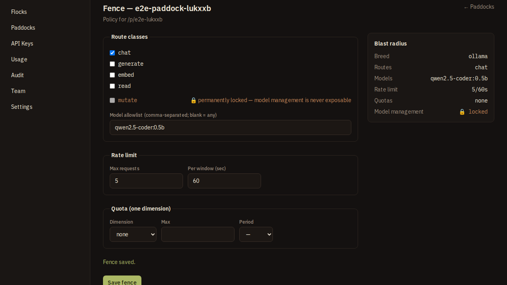
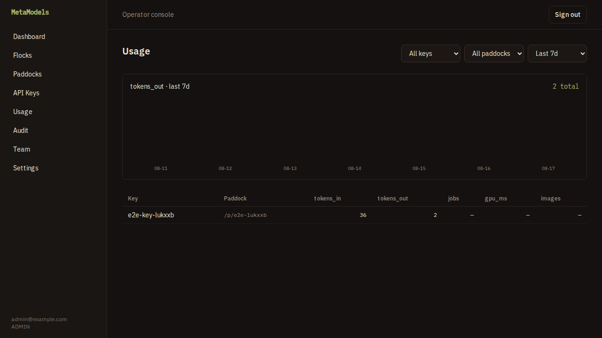

# MetaModels

Self-hosted governance and monetization for local AI. MetaModels puts authentication, API keys, rate limits, per-provider constraints, and usage metering in front of an otherwise unprotected Ollama or ComfyUI server, so you can safely expose one to other people — or bill for it.

## Run the stack

```bash
cp .env.example .env   # edit secrets + operator login
docker compose up -d --build
docker compose run --rm control-plane pnpm seed
```

Control-plane UI at http://localhost:3000, data-plane proxy at http://localhost:8787 — set `CONTROL_PLANE_PORT` / `DATA_PLANE_PORT` in `.env` if either is already taken. Full instructions: [docs/DEPLOY.md](docs/DEPLOY.md).

## How it works

You connect a **flock** (a local AI server), publish a **paddock** on it (a public endpoint), and draw a **fence** around that paddock — the policy. Consumers get an API key scoped to the paddock and call the proxy; everything the fence forbids never reaches your GPU.



The fence above allows exactly one route class and one model, at five requests a minute. **Blast radius**, on the right, is the console reading that policy back in plain language — including the one setting you cannot turn on: model management is never exposable, so no key can ever pull or delete a model on your server.

Every allowed call is metered per key and per paddock, which is what makes billing possible:



Every configuration change is recorded in an audit log, attributable to the operator who made it.

## Is it actually enforced?

Yes, and there is a test that proves it end to end. [`apps/e2e`](apps/e2e) drives the console in a real browser to build the setup above, then calls the proxy as a consumer would:

| Request | Result |
|---|---|
| Allowed model, allowed route | **200** — reaches the real model |
| A model outside the allowlist | **403** |
| `POST /api/pull` (model management) | **403** |
| No API key | **401** |
| Past the rate limit | **429** |

Run it yourself against your own hardware — see [apps/e2e/README.md](apps/e2e/README.md). The screenshots on this page are generated by that suite, so they cannot drift from what the software actually does.
